# Weatherial

<p align="center">
 
</p>
  
<p align="center">
 

 
</p>

<p align="center">
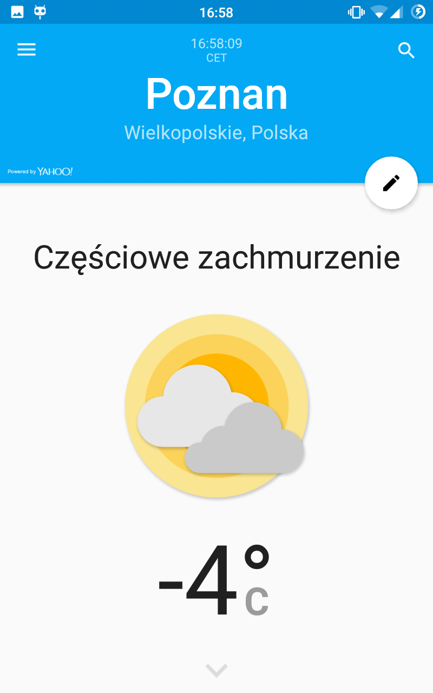 
 
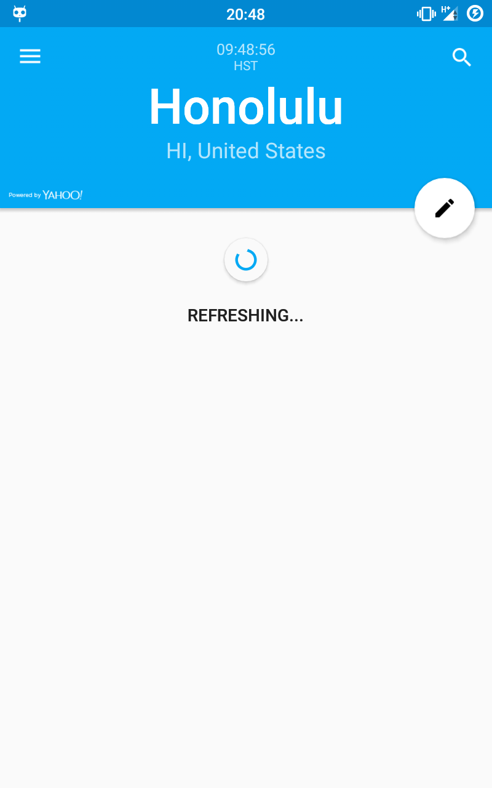  
</p>

<p align="center">
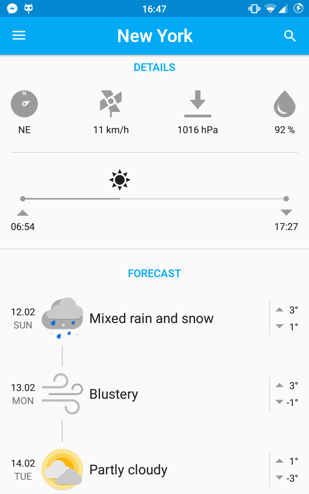
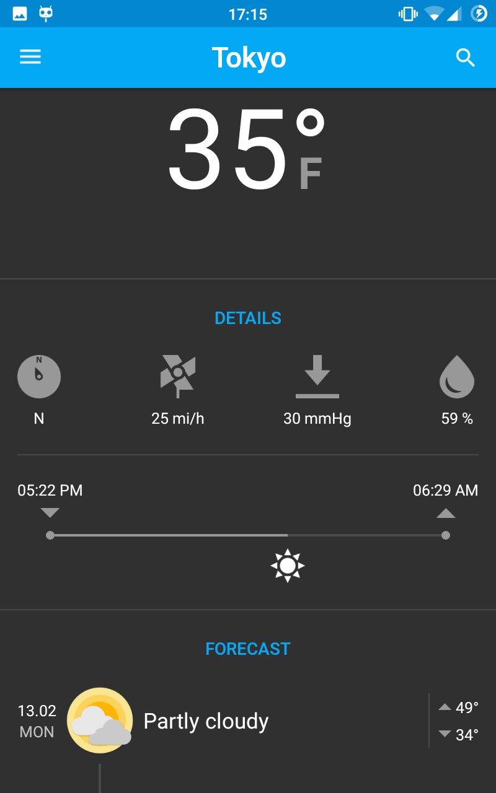
  
</p>

<p align="center">
 
 
 
</p>

<p align="center">  
<a href='https://youtu.be/TXWGDiH4E7s'>

</a>
</p>

<p align="center">  
<a href='https://play.google.com/store/apps/details?id=paweltypiak.weatherial&pcampaignid=MKT-Other-global-all-co-prtnr-py-PartBadge-Mar2515-1'>
</a>
</p>

**Weatherial** is a simple weather app for Android with a flat user interface inspired by _Material Design_. 

- application is dedicated to devices with at least Android 4.1 Jelly Bean (API 16). 
- supported screen sizes: normal, large, xlarge
- it has been tested on multiple devices:
  - Samsung Galaxy Note (5.1 Lollipop)
  - Samsung Galaxy S6 Edge+ (6.0.1 Marshmallow)
  - Emulators with all supported densities and Android versions

### Main features

- providing weather information by **_Yahoo Weather API_** 
- providing address information by **_Google Maps Geocoding API_**
- using **REST** webservices
- using **_Firebase_** for crash reporting
- Using **_ProGuard_** in release version to optimize Java bytecode
- user interface is inspired by **_Material Design_** guidelines provided by _Google_
- **two language versions** - polish and english, based on user's preferences and **Locale** class
- using classes extending **AsyncTask** to download information in background
- using **interfaces** to send callbacks between classes
- creating **different UI thread** to **dynamically updade layout** with 1 sec interval
- using **Runnable** objects to pass methods between different objects
- using **fragments** with nested fragments inside them with **two way communication** between fragments and Activity
- using **Bundle** to pass data between Activities and using **Parcelable** to pass custom objects
- handling **application lifecycle** - using lifecycle methods, saving current data by using **onSavedState** method
- using **abstract classes and inheritance**
- using universal, **multi-use static classes** and methods
- possibility of **saving user's favourite locations**
- using **SharedPreferences** for saving user's preferences
- requesting **Marshmallow permissions** at runtime
- all colors and dimensions are stored in **resources files**
- providing drawables for **5 different densities**
- **responsiveness of layout** achieved by using weights and programically measuring views
- providing **custom themes in Styles.xml** for activities and views
- **dynamic theme changing** based on current day time
- using **dialogs with custom styles** and layouts
- using **Picasso library** to load big images efficiently
- changing **icons colors programically**
- using **AppCompat library** to provide _Material Design_ views on pre-Lollipop devices
- using **String class and Calendar class** for data formatting
- **no deprecations** - using proper methods dedicated to different SDK versions

### Important information
- If you want to use Firebase, you have to connect your Firebase account to this project. You can read more about this on the [Firebase web page](https://firebase.google.com/docs/android/setup).

- If you want to generate release version of apk, you have to sign it with your own key. You can read more about this here: [Application signing tutorial](https://developer.android.com/studio/publish/app-signing.html). In other case you have to delete from module Gradle file (usually the [app/build.gradle ](/app/build.gradle)) the following lines:

``` 
def keystorePropertiesFile = rootProject.file("keystore.properties")
def keystoreProperties = new Properties()
keystoreProperties.load(new FileInputStream(keystorePropertiesFile))
```

```
signingConfigs {
        config {
            keyAlias keystoreProperties['keyAlias']
            keyPassword keystoreProperties['keyPassword']
            storeFile file(keystoreProperties['storeFile'])
            storePassword keystoreProperties['storePassword']
        }
    }
```

```
signingConfig signingConfigs.config
```
### Project Description

### Launch Activity.

Layout of this activity has two nested layouts: one is for _CardView_ button on the bottom, the other one is a _FrameLayout_ for the settings fragments. At the beginning of the _onCreate()_ method of this activity there is loaded a proper fragment, depending on the information if it is the first launch of application. This information is stored in _SharedPreferences_.

####  1. First Launch

- Just after launch there is shown a splash screen with application logo.

    <p align="center">
    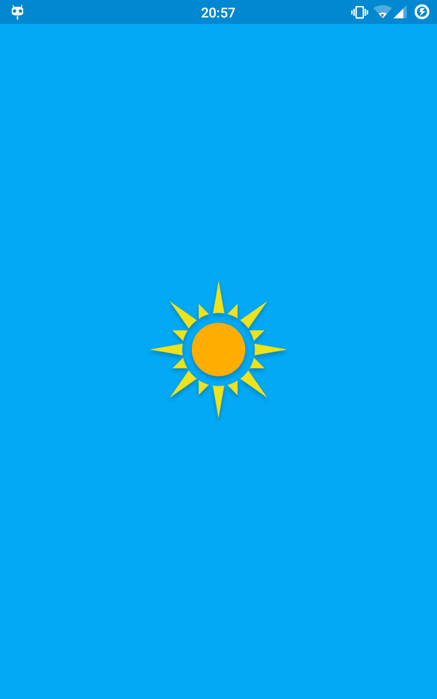
    </p>
    
- After activity initialization there is shown the first fragment. At the bottom of the screen there is a button, which inserts the next fragment.

    <p align="center">
    
    </p>
    
- Another fragment contains two layouts - one is an _ImageView_ with application logo, another one is a nested fragment, which shows initial settings.

  - Language fragment gives user the possibility to change the language version. After selecting different option the proper preference is saved to _SharedPreferences_ and the proper value for _Locale_ class is set. Then the layout is immediately reloaded to make the changes visible in a real time. 
  
    <p align="center">
     
     
    </p>
 
  - Units fragment lets the user change the measurement system. After selecting particular unit, all units' preferences are converted to a single _String_ value and saved to _SharedPreferences_.
    <p align="center">
    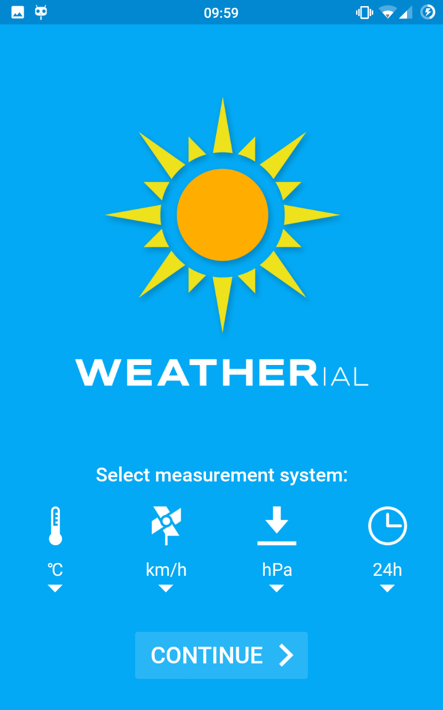 
     
    </p>
 
  - Location fragment is used to choose the default location for which the weather information will be downloaded. 
    - First option means that the default location is the user's current position.
    
    <p align="center">
    
    </p> 
  
    - After choosing _Different location_ option there is shown a dialog with _EditText_, where the user have to enter location. Even if the input contains some empty characters, after changing focus to the background of the dialog it is formatted to the _String_ without empty spaces and its first letter is uppercase. If the user will dismiss the dialog without entering location, after selecting _Continue_ button there is shown a dialog with the proper information. After choosing _OK_ button previous dialog pops up.
    
    <p align="center">
     
     
    </p>
  
    <p align="center">
    
     
    </p>
   
   - If the user selected _Current location_ there is loaded the geolocalization method fragment, where he can choose between using GPS or network. 
   
    <p align="center">
    
    </p> 
   
    Then, another fragment is loaded and geolocalization process is started. If the API version is 23 or higher, the user has to give permissions to use localization. If the permission is denied, the proper dialog is shown.
    
    <p align="center">
    
     
    </p>
    
    In other case the process is continued. In this step user's current coordinates are downloaded.
    
    <p align="center">
    
    </p> 
    
    If the provider selected by user is unavailable, he is informed about this situation by the proper dialog. Then, if the other provider is available, it is used for geolocalization, in other case the information about geolocalization failure is shown. Next, the user can move back to the location fragment and select different location.
    
    <p align="center">
    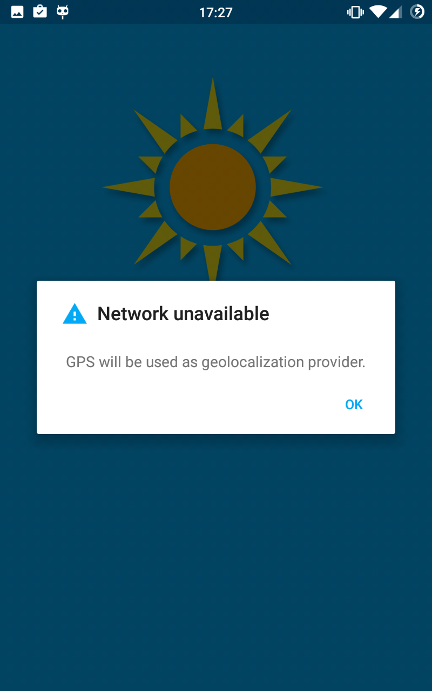 
     
    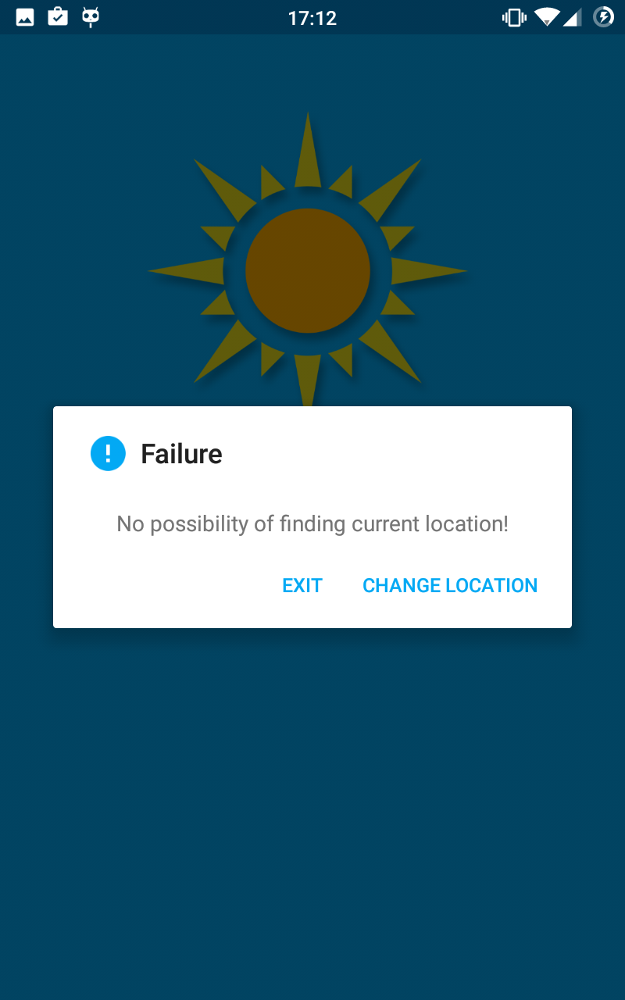 
    </p>
    
  Received coordinates are used in _Google Maps API_ to determine the address of the current location. 
  
    <p align="center">
    
    </p> 
    
 In case of the internet connection failure or empty response from the service, proper dialog is shown and the user may leave the application or change the location.
 
    <p align="center">
    
     
    </p>
     
   Address data received from _Google Maps API_ is used to download weather information from _Yahoo Weather API_.
   
    <p align="center">
    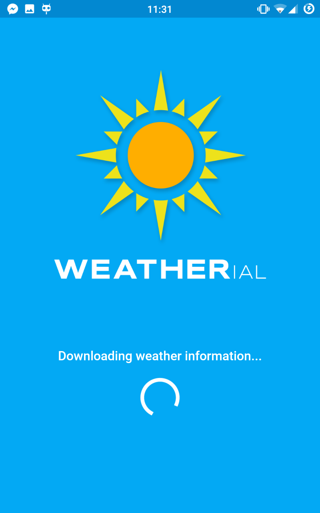
    </p> 
   
   If there is a problem with internet connection or with the service response, information dialog is shown.
    
    <p align="center">
     
    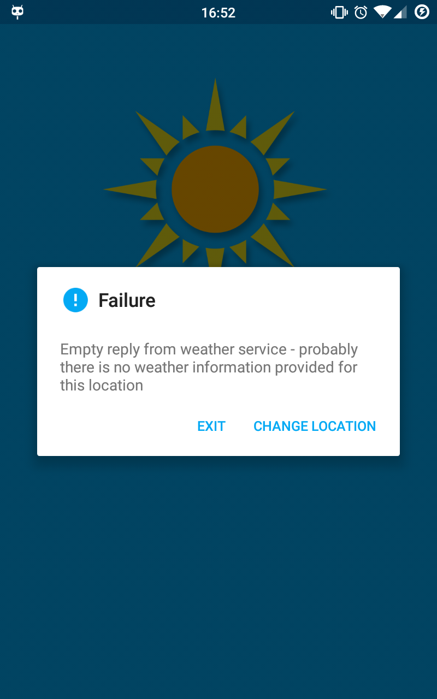 
    </p>
    
  - When _Different location_ is selected, weather downloading for entered location is started. 
  
    <p align="center">
    
    </p> 
    
  If the response from the server is empty, it probably means that there is no weather information for this location - in this situation dialog pops up and the user has the possibility to move back to the fragment where he can change the location. User is also informed if the internet connection is interrupted, so after reconnecting the downloading process can be refreshed.  
  
   <p align="center">
   
    
   </p>
   
 When response from the server contains data, there is shown a dialog with detailed information about the search result. User can accept this location, or he can move back to the location fragment to change his choice. He can also exit from the application.
 
   <p align="center">
   
   </p> 
   
 - If weather data downloading process is succeeded, the information about default loation and successfull first application launch is stored in _SharedPreferences_. After this process the object with necessary weather data is passed to the main activity by using _Parcelable_ class.
 
   <p align="center">
   
   </p> 
 
#### 2. Next launches

Every next launch is started by inserting the loading fragment with selected localization option. Depending on the user's choice there are two types of processes that may be started - geolocalization process in case of selecting user's current location or weather information downloading in the other case. This procedure looks almost the same as it was described in the previous chapter.

   <p align="center">
    
   
   </p>
 
   <p align="center">
    
   
   </p>
 
Although, there are some small changes:

- In geolocalization mode when there is a problem with receiving current location the dialog with user's favourites is shown. This solution gives the possibility to change the location.

   <p align="center">
   
   </p> 

- When the user wants to download weather for the location which is different than the current one, the main activity is loaded without the information about the searched location. The reason for using this solution is because of the fact, that the user knows what is his default location, so the information about the found location is unnecessary.
 
### Main Activity.

In _onCreate()_ method of the main activity all the weather data information passed from the previous activity is loaded. 

#### 1. Main screen interface

The _MainActivity_ layout is based on a custom _CollapsingToolbarLayout_ and _NestedScrollView_. Screenshots with a few random locations are shown below. Screenshots for particular location has been merged to show the whole layout.    

   <p align="center">
    
   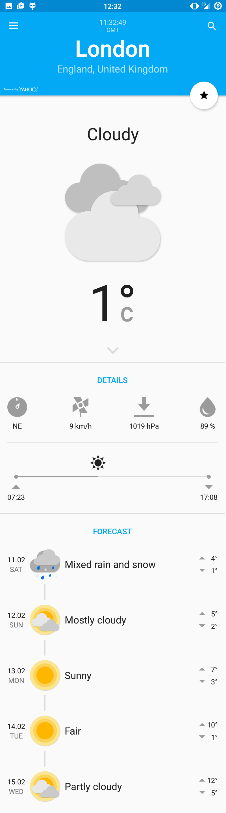
   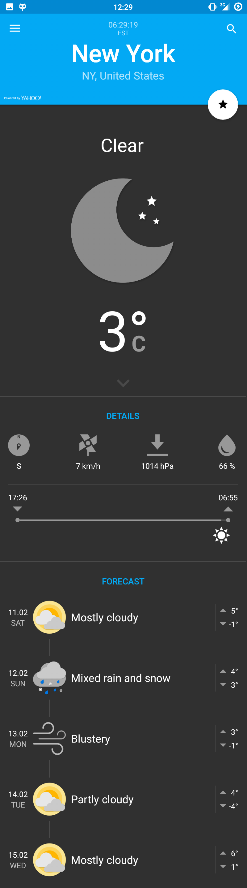 
   </p>

- Main elements

    - App Bar
    <p align="center">
     
    </p>
        - _Navigation Drawer_ toggle
        - search button
        - local time for current location in seconds
        - timezone name for current location
        - primary name for current location
        - secondary name for current location
        - _Yahoo_ logo (attribution requirements)
        - _Floating action button_ for saving/editing location
        
   - Basic weather conditions
   <p align="center">
   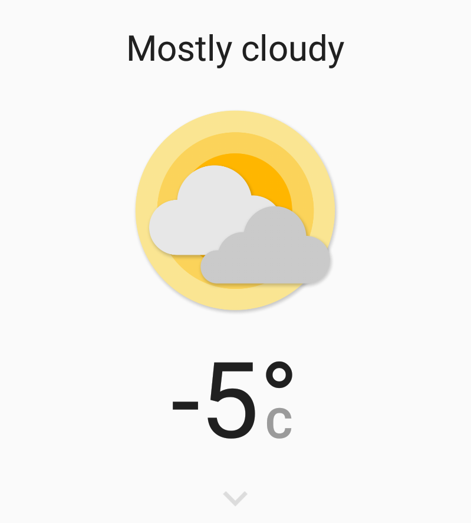 
   </p>
        - text information about current conditions with proper icon
        - current temperature with selected unit
    
    - Detailed weather conditions
   <p align="center">
   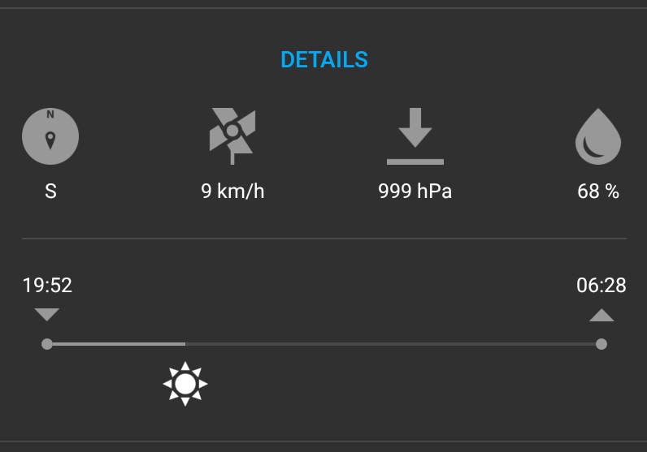 
   </p>
        - information about sunrise and sunset time
        - interactive visualisation of current sun position
        - current wind direction (pointer points real wind direction)
        - current wind speed
        - current atmospheric pressure
        - current humidity level
    
    - 5 day forecast
   <p align="center">
   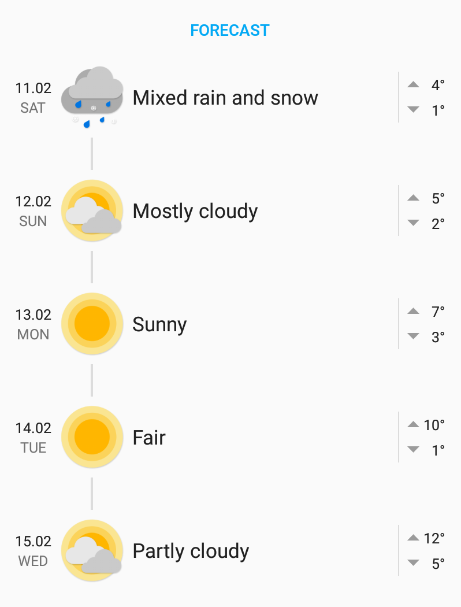 
   </p>
        - general weather conditions visualised by icons
        - date with day number
        - maximum and minimum temperatures
    
- Dynamic layout change

   <p align="center">
   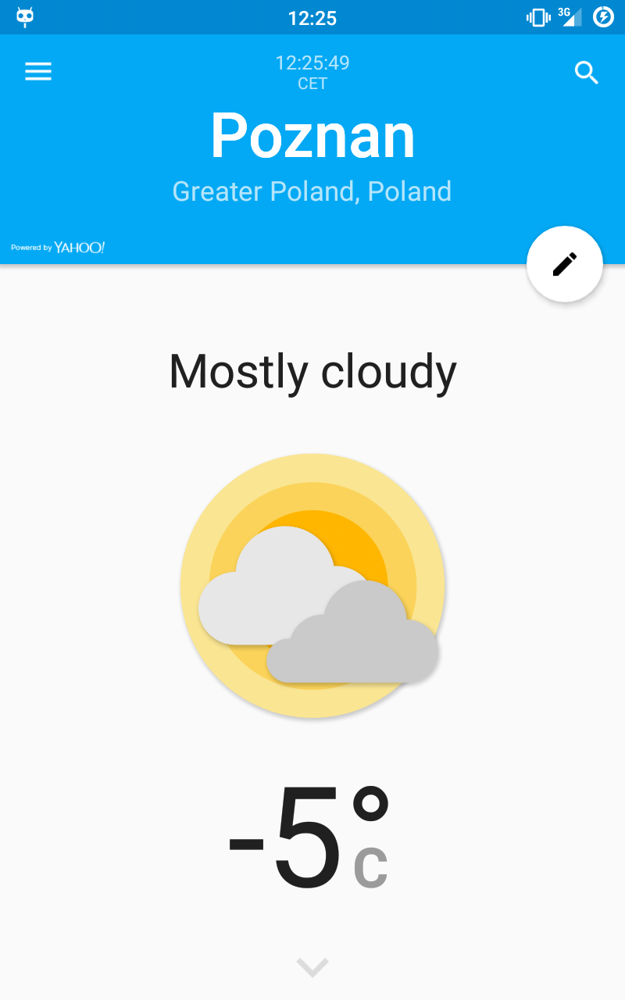
   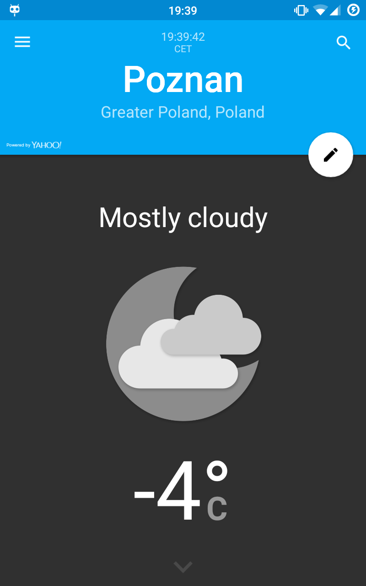 
   </p>
   
   <p align="center">
   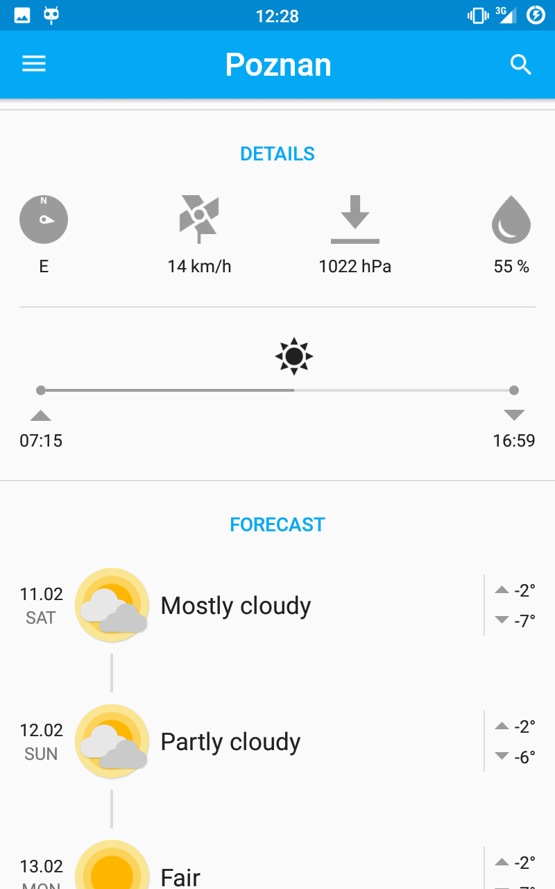 
   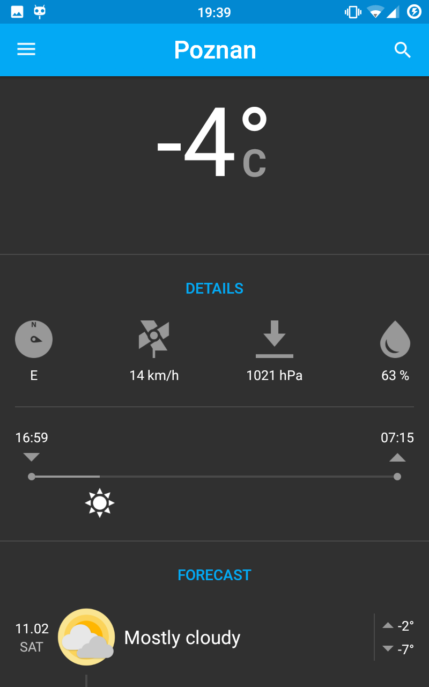 
   </p>
   
    Thanks to the additional UI thread it is possible to dynamically change the layout appearance. Every second the _Runnable_ object, which was passed to the thread initializing method, is rerunned to reload layout. It is used for displaying changes related with time and sun position.
    
   <center>   
   
    |Element | time interval |
    |:------------ | :------------ |
    |clock | 1 sec|
    |sun position on a line | 1 min|
    |day/night theme | twice a day|
    |sunrise/sunset time and icon position swich | twice a day|
    |sun/moon icon swich | twice a day|
    
    </center>  
   
- Measurement system

   <p align="center">
   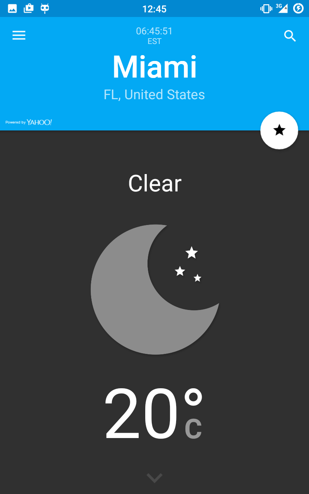 
    
   </p>
   
   <p align="center">
   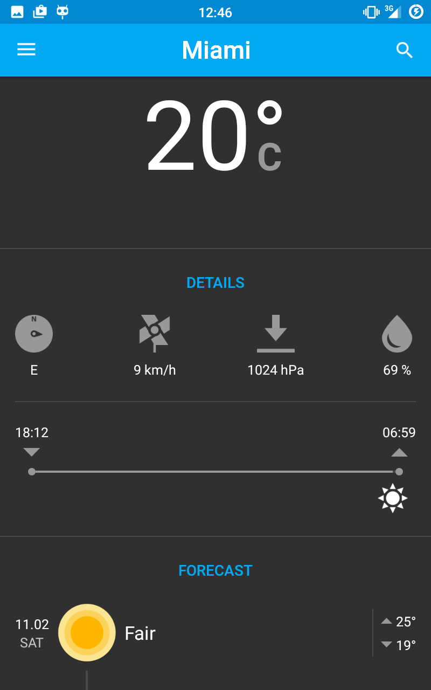 
   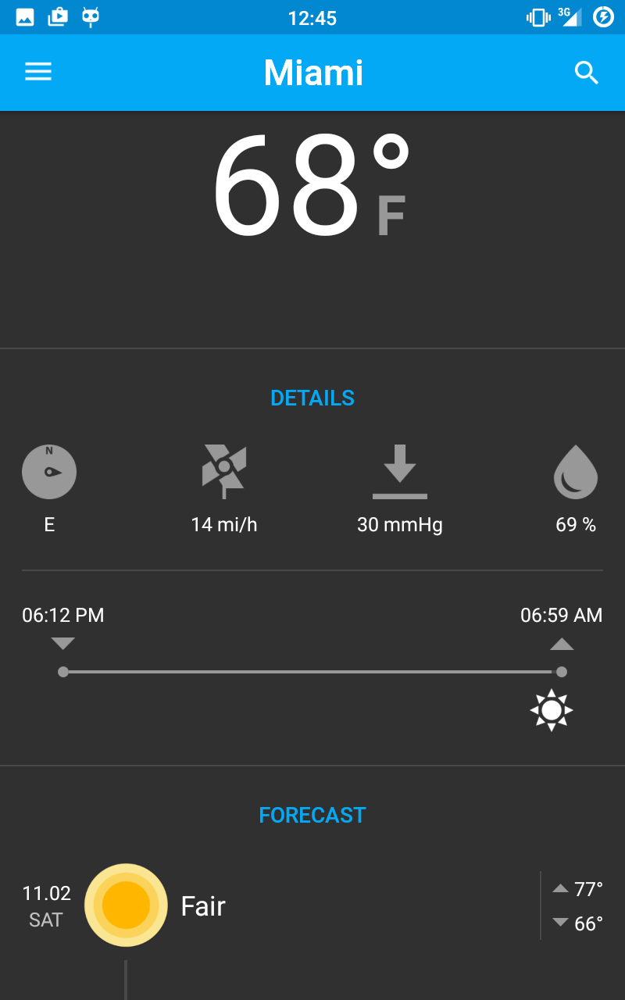 
   </p>
   
   Application gives the user a possibility to change the measurement system for the following elements:
   - temperature: C/F degrees
   - wind speed: kmph / mph
   - atmospheric pressure: hPa/mmHg
   - time format: 12h/24h
   
   User can change units in application settings available in _Navigation drawer_.
   
- Exit dialog

   <p align="center">
    
   </p>
   
    When the user pushes the back button there is a confirmation dialog showing up. This solution prevents from accidentaly leaving the application.

#### 2. Main screen intents

- Maps intent

When the user clicks on the current location name, there is a dialog showing up. After confirmation user is redirected to _Google Maps_.
   <p align="center">
    
   </p>
   
- Web intent

According to _Yahoo Weather API_ usage requirements, after clicking the _Yahoo_ logo user is redirected to _yahoo.com_ website. _Yahoo Weathe_ website with current location weather conditions is opened after choosing any of the weather information located on the main screen.
   <p align="center">
    
   
   </p>

#### 3. Location search

User has the possibility to search the weather information for every location provided by _Yahoo Weather_. After choosing the icon in the top right corner of the screen a dialog pops up. Here, the user has to enter his desired location. Before he do this, search button is inactive. After entering the location and clicking outside the _EditText_ location name is formatted - before and after spaces are deleted and first letter is converted to uppercase. 

   <p align="center">
   
     
    
   </p>
   
   The next step is to send a request to the server. In case of successful response there is a dialog showed up with the information about the found location. If there was a problem with internet connection or the request is empy, proper message is displayed on the screen.

   <p align="center">
   
    
    
   </p>
   
#### 4. Swipe to refresh
   In application there is implemented the _SwipeToRefreshLayout_. This layout gives the possibility to refresh weather data by swiping down the screen when the user is on the top of _MainActivity_.
   
   <p align="center">
   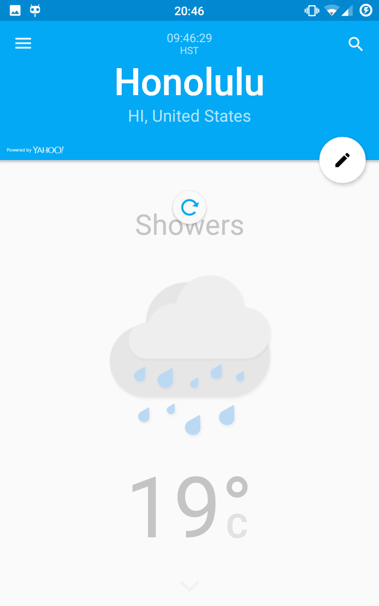
   
   </p>

When internet failure or service failure occurs, proper dialog is shown on the screen. If case of selecting the _Cancel_ button, data with previous weather information is loaded.

   <p align="center">
   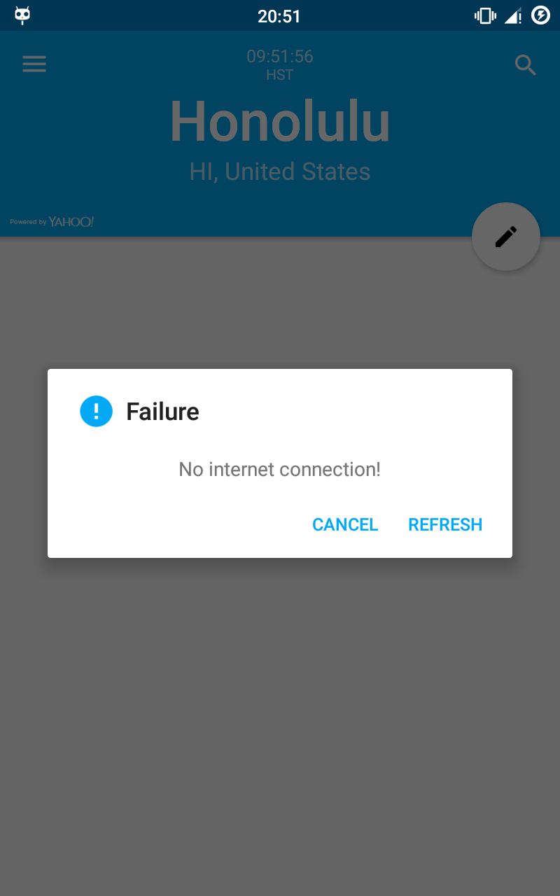
   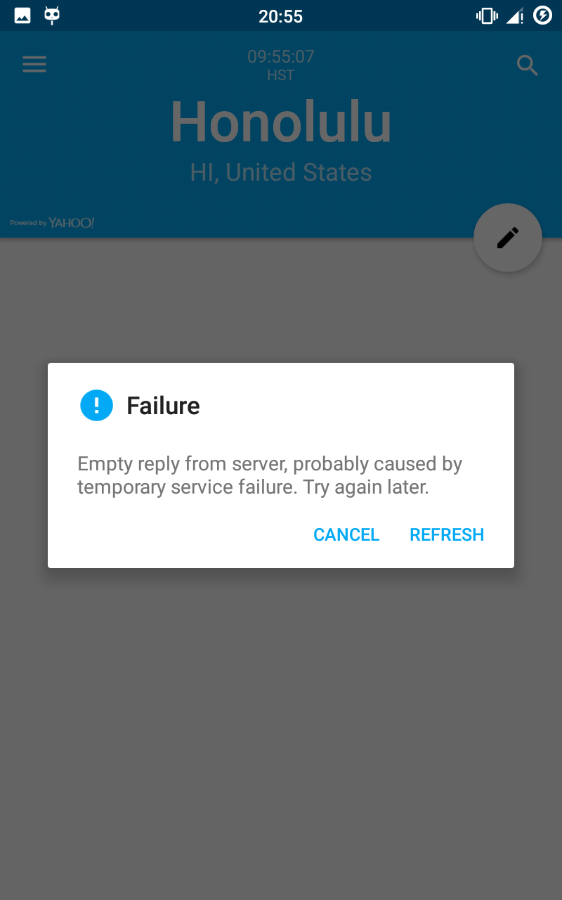
   </p>

#### 5. Navigation drawer

   Application has the _Navigation Drawer_ with the application logo at the top and several additional options to select:
   - Geolocalization
   - Favourites
   - Settings
   - Send feedback
   - About
   - Author
   <p align="center">
    
   </p>
   
#### 6. Geolocalization
 
   After choosing the _Geolocalization_ option from the _Notification Drawer_, geolocalization process is started. At the beginning the user is asked to select the geolocalization method if he didn't do this yet. 

   <p align="center">
    
   </p>
   
   Next, if the device has at least API level 23, the user has to grant the permissions to use the localization. 
   
   <p align="center">
   
   
   </p>
   
   In case of inaccessibility of the provider selected by the user, the other one is going to be used for retrieving current device coordinates. This information is showed up in a dialog.
   
   <p align="center">
   
   
   </p>
   
   If there is no provider available or there is a security exception dialog with a proper information is opened.
   
   <p align="center">
    
   
   </p>
   
   If all of the needed conditions have been met, the process of obtaining the position is started.
   
   <p align="center">
    
   </p>
   
   Coordinates retrieved in the previous procedure are used to find the location adress by using _Google Maps API_. 
   
   <p align="center">
    
   </p>
   
   If there is a problem with internet connection or a server request there is a dialog displayed with a proper information.
   
   <p align="center">
   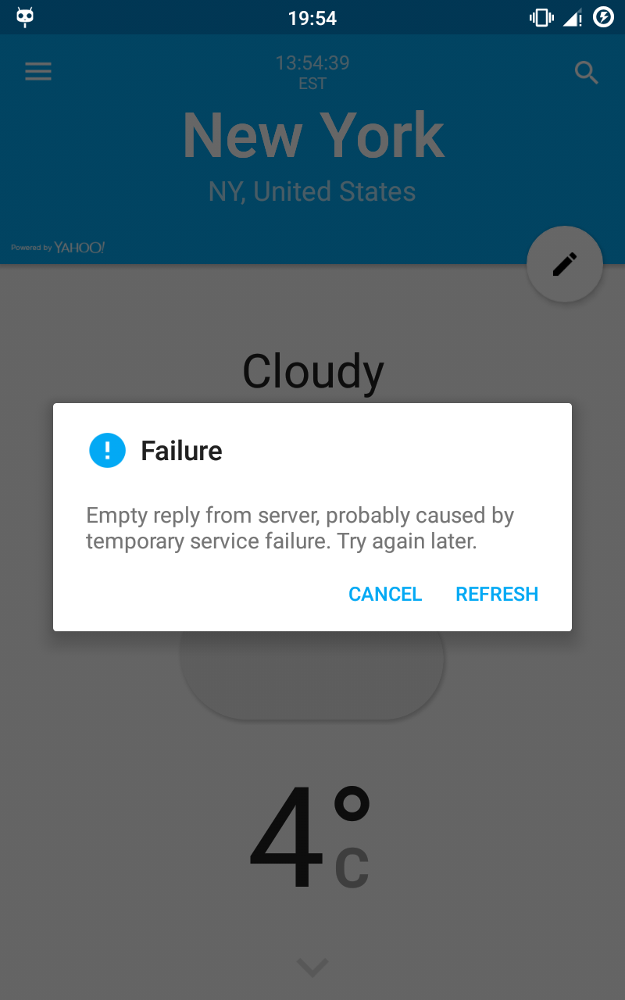 
   
   </p>
   
   The last step is downloading the weather information for the found location.
   
   <p align="center">
    
   </p>
   
   If this operation is succeeded, all the weather information is loaded in the main screen. In case of failure the proper information is showed up. 
   
   <p align="center">
    
   
   </p>

#### 7. Favourites

User has the possibility to save the location to the favourites list. After selecting the _Floating Action Button_ whith the star icon on it, there is shown a saving dialog with the option of changing the primary and secondary location name and setting this location as a default. User can always edit saved location by selecting the same _Floating Action Button_, but now with the edit icon on it.   

   <p align="center">
    
   
    
   </p>
   
When the user save location, the icon of _Floating Action Button_ is changed and the _Favourites_ option in _Navigation Drawer_ is highlighted.   
   
   <p align="center">
    
   
   </p>
   
   <p align="center">
   
   
   </p>
   
   If the user hasn't add any location yet, after selecting _Favourites_ option in _Navigation Drawer_ there is displayed with a proper information. In the other case a dialog with scrollable favourites list is shown.
   
   <p align="center">
   
   
   </p>

#### 8. Other options in Navigation Drawer

- Send feedback

User has the possibility to send the e-mail to the author of this application. After long clicking on the author's e-mail address it is copied to clipboard, which is showed by the _Toast_ message. After clicking _Send_ em-mail intent is used and an e-mail application is opened. If the user doesn't have the necessary applciation he is informed about this in dialog. In this situation he can copy the author's e-mail address to use it e.g. in a browser.
   <p align="center">
    
   </p>
   
- About

After selecting _About_ option there is shown an info activity with a basic information about _Weatherial_.
   <p align="center">
   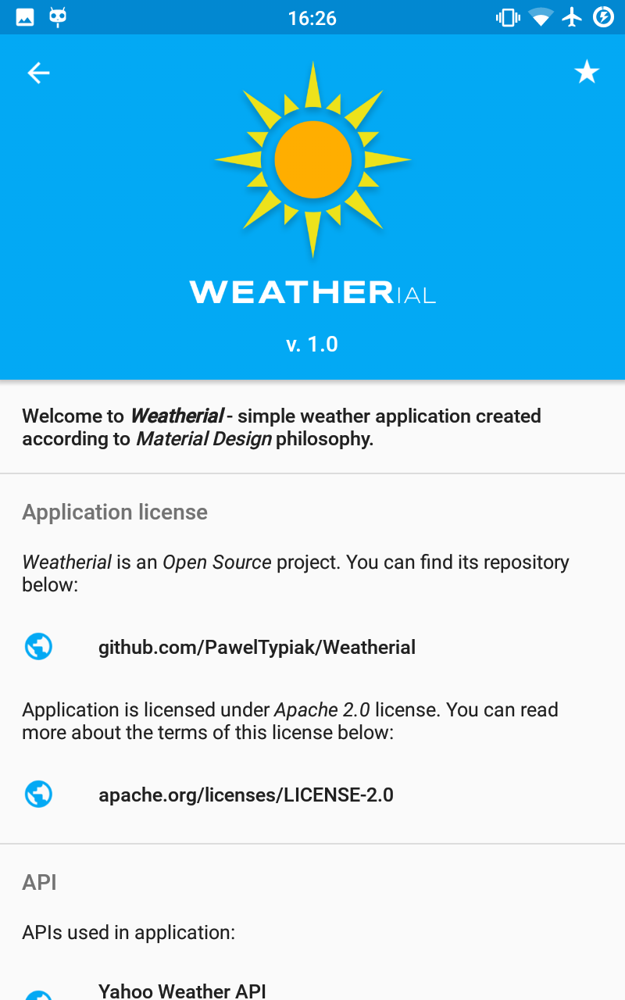
   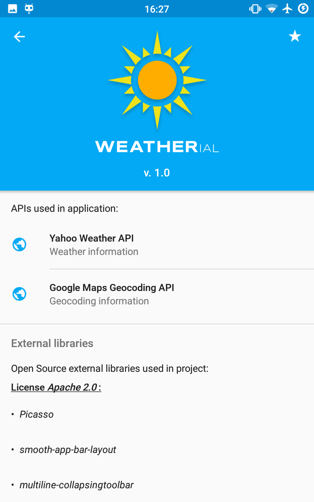
   </p>
   
At the top right corner of the AppBar there is a rate dialog icon. 
   <p align="center">
   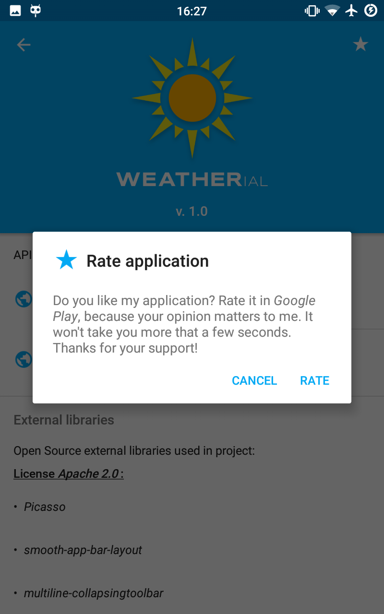 
   </p>
   
- Author

In _Author_ section the user can find the information about my e-mail address and _GitHub_ repositories. After selecting one of those options e-mail or web intent is opened.
   <p align="center">
    
   </p>
  
### Settings

After selecting the _Settings_ option in _Navigation Drawer_, _Settings_ activity is opened.
   <p align="center">
    
   </p>
   
- Settings dialogs

Every dialog is created in separate class. All classes extends _CustomDialogPreference_ class which extends _DialogPreference_ class. Changes are saved to _SharedPreferences_ after clicking _Select_ button. 
   <p align="center">
   
   
    
   </p>
   
- Units subsection

After selecting _Units_ option there is opened a _Units_ activity, where the user can change the measurement system. All units preferences dialogs extends _UnitsDialogPreference_ class, which extends _CustomDialogPreference_ class.
   <p align="center">
    
    
   </p>

### Licensing
_Weatherial_ is licensed under **_Apache 2.0_** license. You can read more about the terms of this icence on the [web page](https://www.apache.org/licenses/LICENSE-2.0) or in [LICENSE.txt](/LICENSE.txt) file.


